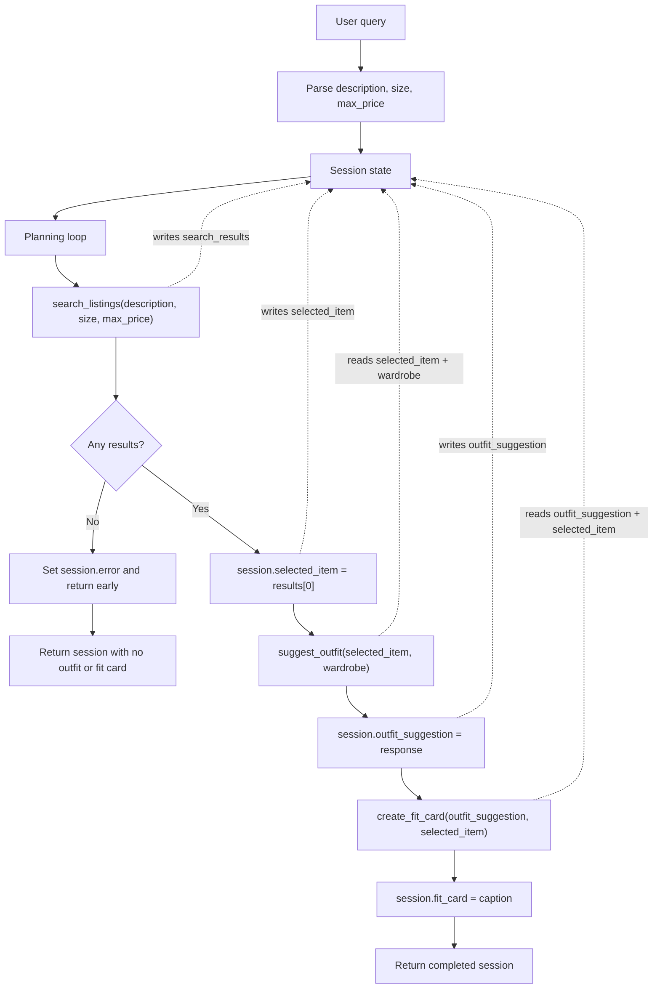

# FitFindr - planning.md

## Tools

### Tool 1: search_listings

**What it does:**
Searches the local mock secondhand listings dataset for items that match the
user's requested item description, optional size, and optional maximum price.
It performs deterministic filtering and scoring so the agent can decide whether
to continue before any LLM calls are made.

**Input parameters:**
- `description` (str): The item keywords from the user query, such as
  `"vintage graphic tee"` or `"90s track jacket"`.
- `size` (str | None): Optional size filter. Matching is case-insensitive and
  supports sizes like `M`, `S/M`, `US 8`, `W30`, and `One Size`.
- `max_price` (float | None): Optional inclusive price ceiling.

**What it returns:**
A list of listing dictionaries sorted by relevance, best match first. Each
listing contains `id`, `title`, `description`, `category`, `style_tags`, `size`,
`condition`, `price`, `colors`, `brand`, and `platform`. If nothing matches, it
returns an empty list.

**What happens if it fails or returns nothing:**
The tool returns `[]` instead of raising. The planning loop stores that empty
list in session state, sets a clear `session["error"]` message, and returns
early without calling `suggest_outfit` or `create_fit_card`.

---

### Tool 2: suggest_outfit

**What it does:**
Uses the selected listing and the user's wardrobe to generate one or two outfit
ideas. If the wardrobe is empty, it generates general styling advice instead of
trying to reference closet pieces that do not exist.

**Input parameters:**
- `new_item` (dict): The selected listing from `search_listings`, including the
  item title, category, size, colors, style tags, price, condition, and platform.
- `wardrobe` (dict): A wardrobe object with an `items` list. Each item has
  `id`, `name`, `category`, `colors`, `style_tags`, and optional `notes`.

**What it returns:**
A non-empty string with styling advice. With an example wardrobe, the response
should name specific wardrobe pieces. With an empty wardrobe, the response
should recommend item categories, colors, and styling details that would pair
well with the new item.

**What happens if it fails or returns nothing:**
If the wardrobe is empty, the tool still returns useful general advice. If the
LLM call fails, it returns a deterministic fallback styling suggestion based on
the new item's category, colors, and style tags.

---

### Tool 3: create_fit_card

**What it does:**
Turns the outfit suggestion and thrifted item details into a short shareable
caption that sounds like an outfit post rather than a product description.

**Input parameters:**
- `outfit` (str): The outfit suggestion returned by `suggest_outfit`.
- `new_item` (dict): The selected listing used in the outfit suggestion.

**What it returns:**
A 2-4 sentence caption that naturally mentions the item title, price, platform,
and overall outfit vibe. Different inputs should produce different captions.

**What happens if it fails or returns nothing:**
If `outfit` is empty or whitespace only, the tool returns a descriptive error
message string and does not call the LLM. If the LLM call fails, it returns a
simple fallback caption built from the item and outfit details.

---

### Additional Tools

No stretch tools are included in the first submission. The project focuses on
the three required tools plus robust state and error handling.

---

## Planning Loop

**How does your agent decide which tool to call next?**

The agent uses a step-based planning loop with a `next_step` variable and a
shared session dict.

1. Initialize session state with the raw query, wardrobe, empty tool outputs,
   and `error=None`.
2. Parse the query with regex/string rules to extract:
   - `description`: the search phrase after removing price, size, and wardrobe
     context text.
   - `size`: a size phrase such as `M`, `US 8`, or `W30`, or `None`.
   - `max_price`: a float from phrases like `under $30`, or `None`.
3. Set `next_step="search"` and enter the loop.
4. In the `search` step, call
   `search_listings(description, size, max_price)` and store the result in
   `session["search_results"]`.
5. If search results are empty, set `session["error"]` to a helpful message
   explaining which filters failed and return the session early. The loop ends
   here and no outfit or fit card tools are called.
6. If search results exist, store `results[0]` in `session["selected_item"]` and
   set `next_step="suggest_outfit"`.
7. In the `suggest_outfit` step, call
   `suggest_outfit(session["selected_item"], session["wardrobe"])`, store the
   string in `session["outfit_suggestion"]`, then set
   `next_step="create_fit_card"`.
8. In the `create_fit_card` step, call
   `create_fit_card(session["outfit_suggestion"], session["selected_item"])`,
   store the caption in `session["fit_card"]`, and set `next_step=None`.
9. Return the completed session.

The important branch is after search: the agent only proceeds if it has a real
selected listing. This prevents the rest of the workflow from running on empty
state.

---

## State Management

**How does information from one tool get passed to the next?**

The session dict is the single source of truth for one user interaction. It
stores:

- `query`: original user text.
- `parsed`: extracted `description`, `size`, and `max_price`.
- `search_results`: the full ranked list returned by `search_listings`.
- `selected_item`: the top listing chosen from `search_results`.
- `wardrobe`: the wardrobe selected in the UI.
- `outfit_suggestion`: the string returned by `suggest_outfit`.
- `fit_card`: the string returned by `create_fit_card`.
- `error`: a message if the workflow terminates early.
- `steps`: a short trace of completed planning steps for debugging/demo use.

State moves forward by reading from and writing to this dict. For example,
`selected_item` is written immediately after search and then passed directly to
`suggest_outfit`; `outfit_suggestion` is written after the outfit tool and then
passed directly to `create_fit_card`. The user does not need to re-enter data
between tools.

---

## Error Handling

| Tool | Failure mode | Agent response |
|------|-------------|----------------|
| search_listings | No results match the query | Store `[]`, set `session["error"]` to a message like `No listings found for "designer ballgown" with size XXS under $5. Try widening the size, raising the budget, or using fewer style keywords.`, and return early. |
| suggest_outfit | Wardrobe is empty | Return general styling advice for the new item, naming item categories and styling details instead of nonexistent wardrobe pieces. |
| create_fit_card | Outfit input is missing or incomplete | Return `I need a non-empty outfit suggestion before I can create a fit card.` and avoid the LLM call. |

---

## Architecture

---

## AI Tool Plan

**Milestone 3 - Individual tool implementations:**

I will use ChatGPT/Codex with the Tool 1, Tool 2, and Tool 3 sections above as
input, one tool at a time. For `search_listings`, I will ask for deterministic
filtering using `load_listings()` and will verify that it filters by price and
size, scores keyword overlap, and returns `[]` for no matches. For
`suggest_outfit` and `create_fit_card`, I will ask for Groq
`llama-3.3-70b-versatile` prompts plus fallback handling, then verify the
functions return non-empty strings and do not crash on empty wardrobe or empty
outfit input.

**Milestone 4 - Planning loop and state management:**

I will give ChatGPT/Codex the Planning Loop, State Management, and Architecture
sections. I expect it to produce a `run_agent()` implementation that parses the
query, calls search first, branches on empty results, stores `selected_item`,
passes it to `suggest_outfit`, then passes `outfit_suggestion` to
`create_fit_card`. I will verify this with pytest tests that monkeypatch the
tools and assert that the no-results branch does not call downstream tools.

---

## A Complete Interaction (Step by Step)

FitFindr should search secondhand listings, pick a usable item, style it with
the user's wardrobe, and turn the result into a shareable caption. The search
result triggers outfit generation; the outfit generation triggers fit-card
creation; an empty search result stops the flow with a helpful message.

**Example user query:** "I'm looking for a vintage graphic tee under $30. I mostly wear baggy jeans and chunky sneakers. What's out there and how would I style it?"

**Step 1:**
The agent parses the query into `description="vintage graphic tee"`,
`size=None`, and `max_price=30.0`. It calls
`search_listings("vintage graphic tee", size=None, max_price=30.0)`.

**Step 2:**
`search_listings` returns matching listings sorted by relevance, such as a
faded graphic or band tee under $30. The agent stores the full list in
`session["search_results"]`, stores the first result in
`session["selected_item"]`, and proceeds only because the result list is not
empty.

**Step 3:**
The agent calls `suggest_outfit(session["selected_item"], wardrobe)`. With the
example wardrobe, the LLM receives the selected tee plus closet pieces like
baggy straight-leg jeans, chunky white sneakers, a black denim jacket, combat
boots, and accessories. The returned outfit text is stored in
`session["outfit_suggestion"]`.

**Step 4:**
The agent calls
`create_fit_card(session["outfit_suggestion"], session["selected_item"])`.
The returned caption is stored in `session["fit_card"]`.

**Final output to user:**
The UI shows three panels: the selected listing with price/platform/condition,
the outfit suggestion using wardrobe pieces, and a short caption-style fit card.
If the search had returned no results, the first panel would show the error and
the outfit and fit-card panels would stay empty.
